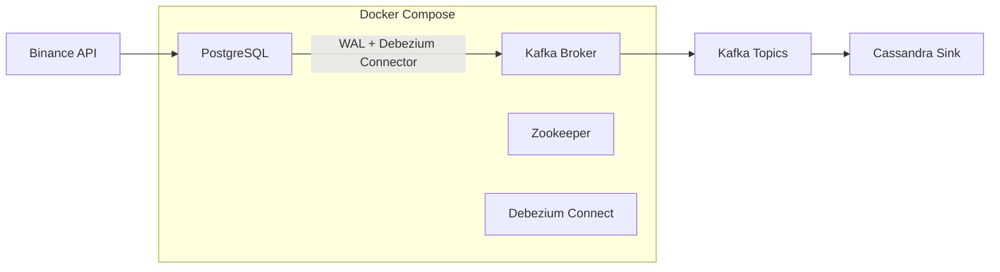

# 📊 Binance Debezium CDC Pipeline

This project demonstrates a **Change Data Capture (CDC) pipeline** that streams **real-time crypto trading data from the Binance API** into **PostgreSQL**, captures changes via **Debezium (WAL)**, and delivers events into **Kafka topics** for downstream processing into **Cassandra**.

It showcases how CDC can be applied in financial/crypto engineering for **low-latency pipelines**, and serves as a portfolio-ready project for demonstrating modern **data engineering practices**.

---

## 🚀 Architecture



**Pipeline Flow:**

1. **Binance API** → fetches live crypto market/trade data.
2. **PostgreSQL** → stores raw Binance trades.
3. **Debezium** → monitors PostgreSQL WAL logs for changes.
4. **Kafka** → streams CDC events to topics.
5. **Cassandra** → ingests final CDC events for analytics/storage.

---

## 🛠 Tech Stack

* **Docker & Docker Compose** – containerized environment
* **Zookeeper** – Kafka coordination (deprecated in Kafka 4+, but used here for compatibility)
* **Kafka** – event streaming backbone
* **Debezium Connect** – CDC engine (PostgreSQL connector)
* **PostgreSQL** – CDC source database
* **Cassandra** – CDC sink database
* **Binance API** – live crypto market/trade data source

---

## ⚙️ Prerequisites

* Docker & Docker Compose installed
* Git installed
* Basic understanding of Kafka & CDC

---

## 🔧 Setup & Usage

1. **Clone Repository**

   ```bash
   git clone https://github.com/your-username/binance-debezium-cdc.git
   cd binance-debezium-cdc
   ```

2. **Start Docker Compose**

   ```bash
   docker compose up -d
   ```

   This spins up:

   * Zookeeper
   * Kafka broker
   * PostgreSQL
   * Debezium Connect

3. **Verify Services**

   * Kafka → `localhost:9092`
   * PostgreSQL → `localhost:5432` (`user=postgres, password=postgres`)
   * Debezium REST API → `http://localhost:8083/connectors`

4. **Register Debezium PostgreSQL Connector**

   ```bash
   curl -X POST -H "Content-Type: application/json" \
   --data '{
     "name": "postgres-connector",
     "config": {
       "connector.class": "io.debezium.connector.postgresql.PostgresConnector",
       "database.hostname": "postgres",
       "database.port": "5432",
       "database.user": "postgres",
       "database.password": "postgres",
       "database.dbname": "postgres",
       "database.server.name": "binance-postgres",
       "plugin.name": "pgoutput"
     }
   }' \
   http://localhost:8083/connectors
   ```

5. **Consume Kafka Topics**

   ```bash
   docker exec -it <kafka-container-id> \
   kafka-console-consumer.sh --bootstrap-server kafka:9092 --topic binance-postgres.public.binance_data --from-beginning
   ```

6. **Stream Data into Cassandra**
   Configure the **Cassandra Kafka sink connector** (Datastax or Confluent connector) to push CDC events into Cassandra.

---

## 🔍 Troubleshooting

* **Zookeeper warning (Kafka 4.x / Debezium 3.x)**
  Kafka 4.0.0+ and Debezium 3.2+ support **KRaft mode** (no Zookeeper). Update `docker-compose.yml` if migrating.

* **Debezium not detecting changes**
  Ensure **logical replication** is enabled in PostgreSQL:

  ```sql
  SHOW wal_level;
  ```

  Should return `logical`.

* **Connector not starting**
  Check logs:

  ```bash
  docker logs <connect-container-id>
  ```

* **Cassandra sink not receiving events**
  Verify Kafka topic messages and connector config.

---

